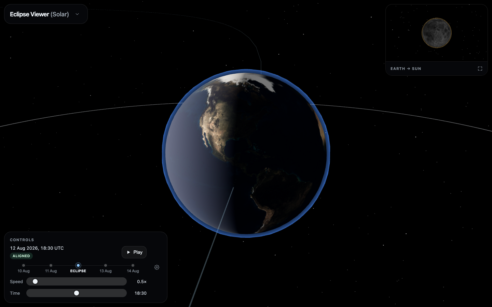

# Eclipse Viewer

Interactive 3D visualizer of solar and lunar eclipses. Distances and sizes use a **classroom scale** by default so the Moon’s 5° orbital tilt is easy to see. A **true scale** toggle uses real size/distance ratios.

UI: English and Catalan. Starts paused on the 12 August 2026 **total** solar eclipse, with Sun, Earth, and Moon in frame.

Live site: **https://daliife.github.io/eclipse-viewer/**



## Why an eclipse is only one day

The Moon’s orbit is tilted about 5° to the ecliptic. An eclipse needs **phase and a node**:

- **Solar** (12 August 2026, ~18:30 UTC / 20:30 CEST): new Moon at a node. This eclipse is total — the Moon looks a little larger than the Sun — and totality crossed Spain.
- **Lunar** (14 March 2025): full Moon at a node, so it enters Earth’s shadow.

The Moon moves about 13° per day, so the day before or after it misses. Use the date jumps to see that.

This is not JPL ephemeris. Dates label constructed keyframes.

## Features

- Sun, Earth, and Moon with NASA / three.js textures
- Play, speed, and day jumps (−2 … eclipse … +2)
- Camera: free orbit, or follow Sun / Earth / Moon
- Earth-view inset (enlargeable) looking at the Sun or the Moon
- Classroom scale vs true scale
- Orbit lines on by default; ecliptic plane and shadow cones optional
- First-visit tour, skippable, in English and Catalan

## Project layout

```
src/
  App.tsx                 # Shell, state
  i18n/                   # Catalan / English
  simulation/             # Didactic orbits and copy keys
  scene/                  # Three.js scene, cameras, helpers
  ui/                     # Controls, education panel, inset, tour
public/textures/          # Sun, Earth, Moon maps
docs/                     # README screenshots
.github/workflows/        # Lint, test, build, GitHub Pages
```

## Local development

Node 22+ and [pnpm](https://pnpm.io/) 11. Versions in `package.json` are exact (no `^` / `~`). Enable Corepack once, then:

```bash
corepack enable
pnpm install
pnpm dev
```

Vite `base` is `/eclipse-viewer/`, so the app is at `http://localhost:5173/eclipse-viewer/`.

```bash
pnpm test
pnpm lint
pnpm build
pnpm preview
```

## Production (GitHub Pages)

Pushes to `main` run [`.github/workflows/ci.yml`](.github/workflows/ci.yml): pin check, frozen `pnpm install`, production audit, lint, test, `vite build`, deploy `dist`. Pull requests run the same checks without deploying. Rapid pushes cancel the previous run.

One-time repo setting: **Settings → Pages → Source = GitHub Actions**. The repo must be public on a free GitHub plan.

## Textures

| File | Source | License |
| --- | --- | --- |
| `public/textures/earth.jpg` | [three.js](https://github.com/mrdoob/three.js) `earth_atmos_2048.jpg` (NASA Visible Earth), resized to 1024px | Public domain (NASA) |
| `public/textures/moon.jpg` | [three.js](https://github.com/mrdoob/three.js) `moon_1024.jpg` | See three.js examples |
| `public/textures/sun.jpg` | [Solar System Scope](https://www.solarsystemscope.com/textures/) 2k Sun (Wikimedia), resized to 1024px | [CC BY 4.0](https://creativecommons.org/licenses/by/4.0/) |

## Stack

Vite, React 19, TypeScript, Three.js, React Three Fiber, Drei. pnpm, exact dependency pins. `pnpm build` typechecks. Lint, tests, and a production audit run on every push to `main` (and on pull requests).
